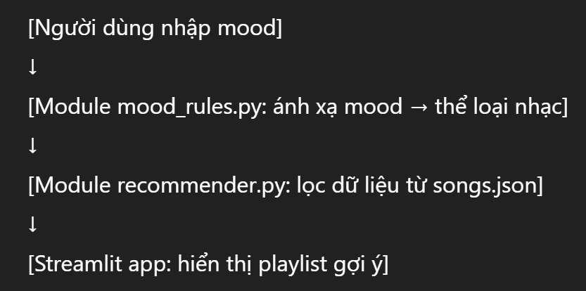

# 🎵 SPECIFICATION DOCUMENT — MUSEEK System

---

## 1. Giới thiệu
**Tên dự án:** MUSEEK  
**Mục tiêu:**  
Xây dựng hệ thống gợi ý bài hát dựa trên **tâm trạng (mood)** của người dùng bằng các quy tắc suy luận và dữ liệu bài hát có sẵn.  
**Phạm vi:**  
Ứng dụng chạy cục bộ (local) bằng Streamlit, hiển thị danh sách bài hát phù hợp với tâm trạng người dùng.  
**Thành viên:**  
- Nguyễn Văn A — Phân tích dữ liệu, xây dựng mô hình gợi ý  
- Trần Thị B — Thiết kế giao diện Streamlit  
- Phạm Văn C — Thiết kế luật và cấu trúc dữ liệu  

---

## 2. Yêu cầu chức năng
| Mã | Mô tả chức năng | Mô tả chi tiết |
|----|------------------|----------------|
| F1 | Nhập tâm trạng người dùng | Người dùng nhập hoặc chọn mood (vui, buồn, thư giãn, tập trung, nhiệt huyết, …) |
| F2 | Gợi ý bài hát phù hợp | Hệ thống dựa trên `rules.json` và `songs.json` để lọc và hiển thị danh sách bài hát |
| F3 | Xem chi tiết bài hát | Hiển thị thông tin: tên, nghệ sĩ, thể loại, năm phát hành |
| F4 | Làm mới playlist | Cho phép người dùng bấm nút “Gợi ý lại” để hiển thị playlist mới cùng mood |

**User Story:**
> “Người dùng nhập mood → hệ thống hiển thị playlist gợi ý → người dùng có thể xem chi tiết hoặc gợi ý lại.”

---

## 3. Yêu cầu phi chức năng
- **Hiệu năng:** xử lý dữ liệu nhanh, không lag (dưới 1s cho mỗi truy vấn).  
- **Giao diện:** đơn giản, thân thiện, sử dụng Streamlit.  
- **Khả năng chạy:** chạy cục bộ (localhost), không yêu cầu kết nối internet.  
- **Khả năng mở rộng:** dễ dàng thêm bài hát hoặc quy tắc mới bằng cách chỉnh file JSON.  

---

## 4. Luồng xử lý
### Mô tả luồng:
    

### Giải thích:
1. Người dùng nhập mood trên giao diện Streamlit.  
2. Hệ thống gọi hàm `get_genres_by_mood(mood)` trong `mood_rules.py`.  
3. Dựa trên các thể loại tương ứng, hệ thống lọc bài hát trong `songs.json`.  
4. Kết quả hiển thị ra danh sách bài hát gợi ý trên giao diện web.

---

## 5. Cấu trúc thư mục

| Thư mục / File | Mô tả |
|----------------|-------|
| `src/app.py` | Giao diện Streamlit chính |
| `src/recommender.py` | Module logic gợi ý bài hát |
| `src/mood_rules.py` | Chứa quy tắc ánh xạ mood → thể loại |
| `src/__init__.py` | Khai báo package Python |
| `data/songs.json` | Dữ liệu bài hát mẫu |
| `data/rules.json` | Dữ liệu quy tắc suy luận |
| `docs/specification.md` | Tài liệu đặc tả dự án |
| `README.md` | Hướng dẫn sử dụng và cài đặt |
| `venv/` | Môi trường ảo Python |

---

## 6. Môi trường & Công nghệ

| Thành phần | Công nghệ / Công cụ | Ghi chú |
|-------------|---------------------|--------|
| Ngôn ngữ | Python 3.10+ | Chính |
| Framework giao diện | Streamlit | Xây dựng UI đơn giản, hiển thị web |
| Suy luận luật | Experta (rule-based AI) | Mở rộng trong giai đoạn sau |
| Quản lý mã nguồn | Git + GitHub | Theo dõi và version control |
| IDE | VSCode / PyCharm | Phát triển và debug |

---

## 7. Kế hoạch 10 tuần triển khai

| Tuần | Nội dung công việc | Deliverables |
|------|--------------------|---------------|
| 1 | Xác định yêu cầu, thiết kế cấu trúc dữ liệu | `specification.md` |
| 2 | Thiết kế file dữ liệu mẫu (`songs.json`, `rules.json`) | Data mẫu |
| 3 | Xây dựng module `mood_rules.py` | File quy tắc hoạt động |
| 4 | Xây dựng module `recommender.py` | Logic gợi ý nhạc |
| 5 | Thiết kế giao diện cơ bản (`app.py`) | Giao diện Streamlit |
| 6 | Kết nối logic và giao diện | Demo chạy hoàn chỉnh |
| 7 | Tích hợp Experta (AI rule engine) | Phiên bản AI-based |
| 8 | Kiểm thử và tinh chỉnh | Test plan |
| 9 | Viết tài liệu README và đóng gói dự án | Repo hoàn chỉnh |
| 10 | Chuẩn bị báo cáo và demo | Bản cuối cùng |

---

## 8. Acceptance Criteria

| Tiêu chí | Mô tả |
|-----------|--------|
| ✅ `README.md` | Có hướng dẫn cài đặt, chạy app |
| ✅ `venv` | Môi trường ảo thiết lập đúng |
| ✅ `data` | Có dữ liệu mẫu (`songs.json`, `rules.json`) |
| ✅ `src` | Chứa đầy đủ file logic |
| ✅ `docs` | Có đặc tả (`specification.md`) |
| ✅ Giao diện | Chạy được trên `localhost:8501`, gợi ý được nhạc |
| ✅ Wireframe | Có thiết kế mô phỏng giao diện |

---

## 9. Wireframe (mẫu minh họa)

> *Dán hình hoặc mô tả đơn giản:*
    
    

---

📅 **Cập nhật lần cuối:** 06/10/2025  
✍️ **Người soạn:** pvq